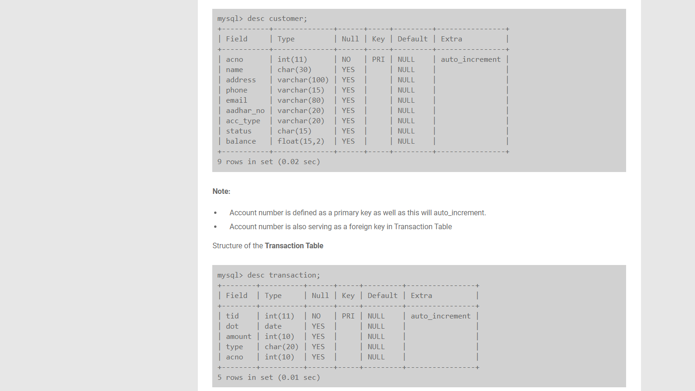
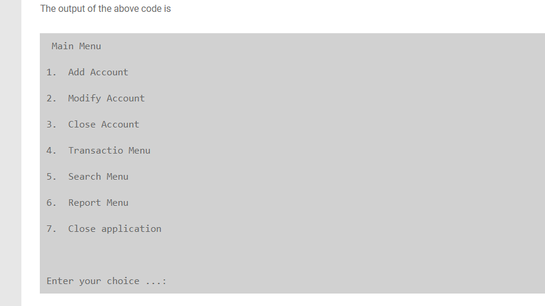
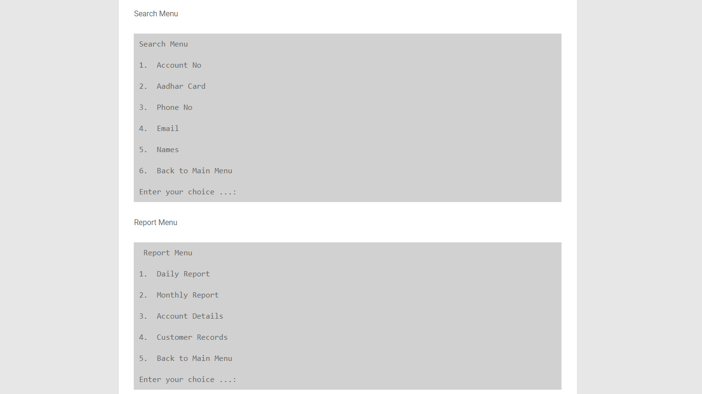
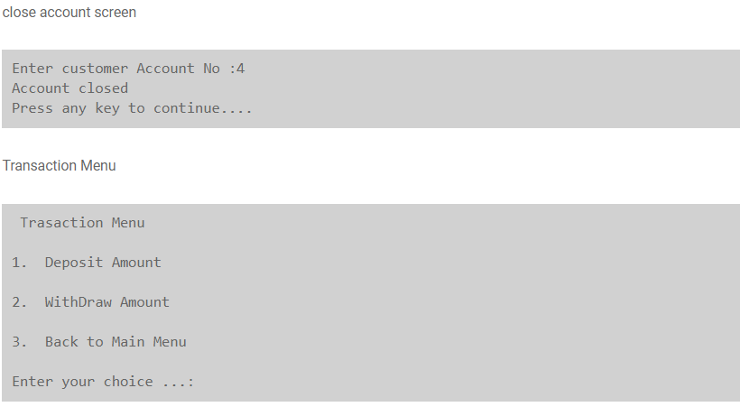

# BankingManagementSystem
#IN CODE WRITE DOWN YOUR DATABASE NAME AND USER,PASSWORD FOR CONNECTION WITH MYSQL
#IN DATABES FIRST CREATE TWO TABLES CUSTOMER AND TRANSACTION

THIS IS THE MAIN MAINU OF APP

#SEARCH MENU AND REPORT MENU

#ONE OF OPERATION FROM APP

